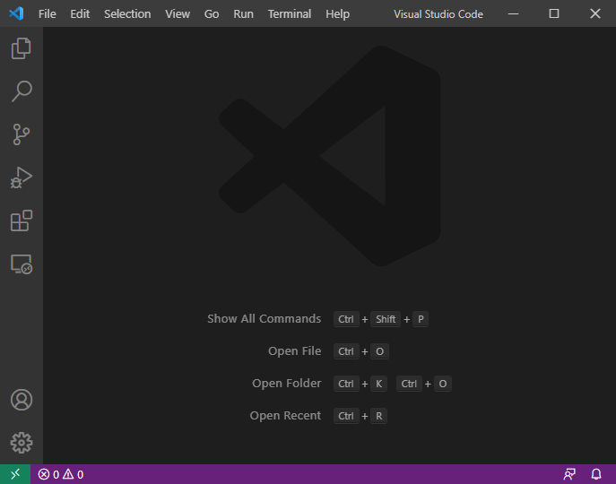

# Lab Report 1 Week 2
This lab report functions as a tutorial for completing CSE 15L lab 1.  
The following steps will be covered:
 - Installing VS Ccode
 - Remotely Connecting
 - Trying Some Commands
 - Moving Files with `scp`
 - Setting an SSH Key
 - Optimizing Remote Running 

## Installing VS Code
Doing this consists of visiting [code.visualstudio.com](https://code.visualstudio.com/) and following the instructions to download and install it on your device. Once it is installed and you open VS Code, you should see a window that looks like this:

## Remotely Connecting
The first step to connecting to your course-specific account for 15L if you are using Windows is to [install OpenSSH](https://docs.microsoft.com/en-us/windows-server/administration/openssh/openssh_install_firstuse). Make sure you run PowerShell as an Administrator for the commands to work correctly. To find the username of your course-specific account, visit [sdacs.ucsd.edu/~icc](https://sdacs.ucsd.edu/~icc/index.php). It will start with `cs15lwi22` followed by three letters unique to your account. To connect to the remote server, run this command in any terminal, with the `###` replaced by your unique letters: `ssh cs15lwi22###@ieng6.ucsd.edu`  
You can open a terminal in VS Code with Ctrl or CMD + `, or using Terminal > New Terminal in the menu.

## Trying Some Commands

## Moving Files with `scp`

## Setting an SSH Key

## Optimizing Remote Running
